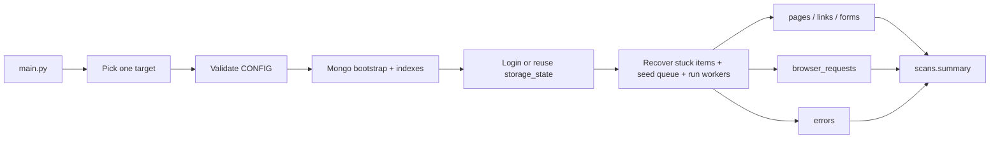

# CYTRIX Authenticated Browser Crawler

A resumable authenticated browser crawler and network capture engine built with **Python**, **Playwright**, **MongoDB**, and **asyncio**.

This repository implements the CYTRIX backend home assignment: real-browser login, bounded asynchronous crawling of the authenticated area, Mongo-backed persistence and resume, and deduplicated request/response capture — runnable with a single command.

---

## Table of Contents

- [Quickstart](#quickstart)
- [Configuration](#configuration)
- [Features Implemented](#features-implemented)
- [What Is Intentionally Not Included](#what-is-intentionally-not-included)
- [Architecture Overview](#architecture-overview)
- [MongoDB Schema](#mongodb-schema)
- [Resume Mechanism](#resume-mechanism)
- [Request/Response Capture](#requestresponse-capture)
- [Safety Boundaries](#safety-boundaries)
- [Login & Session](#login--session)
- [Running with Docker](#running-with-docker)
- [Running Locally](#running-locally)
- [Tests](#tests)
- [Troubleshooting](#troubleshooting)
- [Final Sample Output](#final-sample-output)
- [Why No MongoDB Transactions](#why-no-mongodb-transactions)
- [Submission Checklist](#submission-checklist)

---

## Quickstart

```bash
docker compose up --build --abort-on-container-exit --exit-code-from crawler
```

This brings up MongoDB, the local demo target, and the crawler. The crawler logs in, crawls the authenticated area, persists everything in Mongo, prints a summary, and exits with code `0` when the queue is drained.

For step-by-step Docker and local instructions see [Running with Docker](#running-with-docker) and [Running Locally](#running-locally).

---

## Configuration

Scan URLs, selectors, and credentials are **hardcoded** in `cytrix_crawler/config.py` as two dictionaries (`_CONFIG_DEMO`, `_CONFIG_PRACTICETESTAUTOMATION`). Per the assignment there is **no** `argparse`, no `sys.argv` parsing, and no HTTP API for configuration.

**Exactly one target runs per process.** `main.py` binds `CONFIG` to either the demo or the practicetestautomation dict before the crawl starts — never both.

| Target | What it is | When to use it |
|--------|------------|----------------|
| **demo** | The small Flask **demo_app** in this repo: deterministic pages and credentials for safe CI/Docker/local testing. | Default for push/PR CI, Docker Compose, and local runs when you need a predictable target. |
| **practicetestautomation** | [Practice Test Automation](https://practicetestautomation.com/) — a **real, public** HTML practice site (not affiliated with this repo). | Manual checks that the crawler works on a live site; **not** used on default CI. |

**Stable `scan_id`:** Each target has its own constant in `cytrix_crawler/config.py` (`SCAN_ID_DEMO`, `SCAN_ID_PRACTICETESTAUTOMATION`) embedded in that target’s config dict. `storage_state` files are named `{scan_id}.json` under `SESSION_STATE_DIR`. If you reuse one MongoDB database across targets or ad‑hoc `scan_id` edits, queue and artifact collections are keyed by `scan_id` — use a separate `MONGO_DB_NAME` or distinct `scan_id` when you need a clean split.

Real public sites may redirect to social/share URLs, show bot challenges (for example Cloudflare), or open pages that need user interaction. The crawler uses a **bounded** Playwright navigation timeout (30 seconds, `wait_until=domcontentloaded`), records navigation failures, applies the existing queue retry/`mark_failed` rules, and **always** closes each worker page in a `finally` block. A best-effort `networkidle` wait is also capped (a few seconds) so a noisy or hung network bar cannot stall the crawl indefinitely.

### Choosing the target locally (`python main.py`)

1. If **`CYTRIX_TARGET`** is set in the environment to `demo` or `practicetestautomation` (aliases `practice` / `real` map to practicetestautomation), that value wins — **no** console prompt (used by Docker Compose and GitHub Actions).
2. Otherwise, if **stdin is a TTY** (normal terminal), `main.py` asks: `1) demo` or `2) practicetestautomation`, then loads only that config.
3. Otherwise (non-interactive, no env), **demo** is used as the safe default.

For **demo**, start `demo_app` first (the prompt reminds you). Examples:

- `docker compose up -d mongo demo-app`
- `cd demo_app && pip install -r requirements.txt && python app.py`

### Choosing the target in GitHub Actions

On **workflow_dispatch**, pick **crawler target** `demo` or `practicetestautomation`. The workflow sets `CYTRIX_TARGET` for the crawl job and prints the choice. **Push / pull_request** only runs tests (no crawl against the real site).

Operational wiring from the environment:

| Variable             | Default                      | Purpose |
|----------------------|------------------------------|---------|
| `MONGO_URI`          | `mongodb://localhost:27017`  | MongoDB connection URI |
| `MONGO_DB_NAME`      | `cytrix_crawler`             | Database used by the crawler |
| `DEMO_BASE_URL`      | `http://localhost:8000`      | Origin for **demo** URLs only; Compose uses `http://demo-app:8000` |
| `CYTRIX_TARGET`      | *(unset)*                    | `demo` or `practicetestautomation` — non-interactive target selection |
| `SESSION_STATE_DIR`  | `sessions`                   | Directory for Playwright `storage_state` |

**demo_app** credentials (see `demo_app/.env.example` and Compose env): email `admin@example.com`, password `Password123!`.

**practicetestautomation** credentials (public fixtures on that site): username `student`, password `Password123`.

---

## Features Implemented

Mapping to the assignment's 20 core requirements:

1. Real Chromium browser via Playwright (no `requests`/`aiohttp`).
2. Navigation to `login_url`.
3. Iterative fill of every entry in `login_steps`.
4. Click of `submit_selector`.
5. Login success detection (URL, cookies, content markers, status of `start_url_after_login`).
6. `storage_state` persisted to `sessions/<scan_id>.json` and reused across runs/workers.
7. Crawl seed = `start_url_after_login`.
8. Extraction of links, forms, scripts, headings, buttons, and page metadata.
9. Per-page Playwright request/response capture.
10. Persistence of pages, links, forms, and network traffic in MongoDB.
11. Link dedup via normalized URL.
12. Form dedup via stable `form_hash`.
13. Request dedup via `sha256` hash of method + normalized URL + identity-relevant headers + body.
14. `allowed_domains` enforced before enqueue.
15. `exclude_patterns` filter before enqueue.
16. `max_depth` honored from the seed.
17. `max_pages` enforced across the scan.
18. Async crawling with bounded worker concurrency.
19. Graceful shutdown on `SIGINT`/`SIGTERM` — in-flight pages drain cleanly.
20. Resume from MongoDB state when re-run with the same `scan_id`.

---

## What Is Intentionally Not Included

- No Flask/FastAPI/HTTP server **for the crawler itself**.
- No CLI argument parsing (`sys.argv`/`argparse`); crawl URLs and selectors live in `config.py`, and `main.py` picks **one** target (console or `CYTRIX_TARGET`).
- No crawler UI.
- No form submission — forms are extracted as metadata only.
- No arbitrary button clicking — buttons are extracted as metadata only.
- No MongoDB multi-document transactions (see [Why No MongoDB Transactions](#why-no-mongodb-transactions)).
- No real security testing or destructive interactions.

> Note: the bundled `demo_app/` is a small Flask fixture used **only** as a deterministic local target. It is not part of the crawler runtime.

---

## Architecture Overview

```
cytrix_crawler/
├── config.py        # Two target dicts + validation; ``main.py`` selects one as ``CONFIG``
├── auth/            # Playwright login, session validation, storage_state handling
├── queue/           # Mongo-backed queue state machine + atomic claim/ack
├── crawl/           # Orchestrator + async worker loop + resume recovery
├── extract/         # URL normalization + links/forms/metadata extraction
├── network/         # Per-page request capture + API/static classification
├── storage/         # Mongo repositories + index bootstrap + summary/error writes
├── dedupe/          # Stable hashing for forms and browser requests
└── util/            # Shutdown / signal helpers
demo_app/            # Local authenticated fixture (login + protected pages + JSON APIs)
main.py              # Entrypoint — `python main.py`
```



### Runtime flow (`python main.py`)

1. Select crawl target (env `CYTRIX_TARGET`, else interactive prompt, else demo); bind `CONFIG` to that target only.
2. Validate `CONFIG`.
3. Install `SIGINT`/`SIGTERM` handlers that set a shared `asyncio.Event`.
4. Connect to MongoDB and ping; bootstrap indexes; upsert the `scans` document.
5. Start Playwright; validate existing `storage_state` if present, otherwise perform login.
6. Persist the structured login result into `scans.login`.
7. If login succeeded: `recover_stuck_items()`, seed the start URL, move scan to `running`, run the workers.
8. For each page: attach the per-page network capture **before** `page.goto`, extract links/forms/metadata, briefly wait for `networkidle`, then flush captured exchanges.
9. Aggregate the summary, persist into `scans.summary` (`completed` or `interrupted`), print it, and exit cleanly.

---

## MongoDB Schema

Collections:

| Collection         | Purpose                                                    |
|--------------------|------------------------------------------------------------|
| `scans`            | Top-level scan record, `config_snapshot`, `login`, summary |
| `crawl_queue`      | Per-URL work items, lockable for safe concurrency          |
| `pages`            | Crawled pages, enriched with metadata + counts             |
| `links`            | Unique discovered links (normalized)                       |
| `forms`            | Unique forms keyed by stable `form_hash`                   |
| `browser_requests` | Captured browser requests, deduplicated                    |
| `errors`           | Per-step operational errors with context                   |

Key indexes:

- `scans`: unique `scan_id`
- `crawl_queue`: unique `(scan_id, normalized_url)`
- `pages`: unique `(scan_id, normalized_url)`
- `links`: unique `(scan_id, normalized_url)`
- `forms`: unique `(scan_id, form_hash)`
- `browser_requests`: unique `(scan_id, hash)`
- `errors`: `(scan_id, occurred_at DESC)`

Example `crawl_queue` document:

```json
{
  "scan_id": "scan_cytrix",
  "url": "http://localhost:8000/settings",
  "normalized_url": "http://localhost:8000/settings",
  "depth": 1,
  "status": "pending",
  "locked_by": null,
  "locked_at": null,
  "attempts": 0,
  "created_at": "2026-05-13T10:00:00Z",
  "updated_at": "2026-05-13T10:00:00Z"
}
```

Notes on response storage: full response bodies are **never** persisted. Only a bounded preview is stored (`MAX_BODY_PREVIEW_BYTES = 64 KiB`) and only for textual content types. Binary/image/font/octet-stream responses keep `body_size` and set `body_preview = null`.

---

## Resume Mechanism

MongoDB is the source of truth for crawl progress.

- Queue states: `pending`, `in_progress`, `done`, `failed`, `skipped`.
- On startup `recover_stuck_items(lease_timeout_seconds=300)` returns expired `in_progress` items to `pending`.
- Idempotent upserts plus unique indexes prevent any duplicate records on rerun.
- Re-running with the same `CONFIG["scan_id"]` resumes the prior state — already-completed work is not redone.
- Queue claim/completion uses `find_one_and_update` with a `locked_by == worker_id` filter so a worker that lost its lease cannot corrupt another worker's state.

### How to interrupt and resume

1. Start the crawler: `python main.py`.
2. Press `Ctrl+C` at any time. The signal handler sets `stop_event`; in-flight pages finish their current work, queue items are released cleanly, and the scan summary is written with `status="interrupted"` and `can_resume=true`. The process prints:

   ```
   Crawl interrupted. State is resumable with the same scan_id.
   ```

3. Re-run `python main.py` with the same `scan_id`. Stuck items recover automatically, the start URL is re-seeded (idempotent), `scans.status` flips back to `running`, and the crawl continues.

If the process is force-killed before the signal handler can run, `recover_stuck_items` still rescues the queue on the next start — graceful shutdown only *reduces* recovery latency, it is not the only safety net.

---

## Request/Response Capture

- Playwright `request` / `requestfinished` / `requestfailed` listeners are attached **per page, before `page.goto`**, so traffic from concurrent workers never cross-contaminates.
- Response body preview is bounded to **64 KiB** and only emitted for textual content types; full bodies are never stored.
- Sensitive headers are redacted before persistence: `cookie`, `authorization` value (replaced by a boolean `has_authorization`), and `set-cookie`.
- Classification (`{is_api, is_static}`) is deterministic, based on URL extension, content-type, method, accept header, URL markers, and JSON-like body prefix. A request can be neither, one, or rarely both.
- Dedup is enforced two ways: a stable `sha256:` request hash and a unique `(scan_id, hash)` Mongo index. The hash deliberately ignores volatile headers (`user-agent`, `date`, `sec-*`, trace IDs, `cookie`, the *value* of `authorization`).
- Capture is **best-effort**: any failure inside Playwright (`request.response()`, `response.body()`, decode, bulk upsert) is logged and counted as `network_capture_failures`; it never blocks `mark_done`.
- For HTML pages the worker calls `page.wait_for_load_state("networkidle", timeout=3000)` before flushing, so inline `fetch(...)` calls have a bounded chance to land in the capture. Timeouts are swallowed silently.

---

## Safety Boundaries

- Only URLs whose host is in `allowed_domains` are enqueued.
- `exclude_patterns` (case-insensitive substring match) blocks risky routes; the demo defaults are `logout`, `delete`, `remove`.
- `max_depth` and `max_pages` cap exploration. `max_pages` is enforced before each `claim_next`, so workers may overshoot by at most `concurrency - 1`.
- Forms are extracted but **never submitted**.
- Buttons and scripts are recorded as metadata only — the crawler never clicks them.
- No destructive interactions are performed against the target.

---

## Login & Session

The login flow is the standard `goto → fill → click → wait` pattern. The result is stored as a structured login object on `scans.login`: `success`, `indicators`, `final_url`, `message`, `validated_at`.

Authentication is considered successful when:

- the browser's final URL is no longer the login page, **and**
- session cookies exist, **and**
- `start_url_after_login` does **not** return `401`/`403`, **and**
- the page does not contain obvious failure markers (`invalid password`, `incorrect`, `login failed`).

Playwright `storage_state` is saved to `sessions/<scan_id>.json` (configurable via `SESSION_STATE_DIR`). On subsequent runs the stored state is validated first; only if it is missing or invalid does the crawler perform a fresh login. **The `sessions/` directory is a runtime artifact and is gitignored.**

---

## Running with Docker

Run the full stack (recommended for review):

```bash
docker compose up --build --abort-on-container-exit --exit-code-from crawler
```

This starts:

- `mongo` (`mongo:7`) with a healthcheck
- `demo-app` (Flask on port `8000`) with a healthcheck
- `crawler` (`python main.py`) which waits for both healthchecks before starting

Expected behavior:

- the crawler service runs with `CYTRIX_TARGET=demo`, so it authenticates against `http://demo-app:8000` (`demo_app`) regardless of the default `CONFIG` line in `config.py`
- pages/links/forms/network requests land in MongoDB
- a summary is printed and persisted to `scans.summary`
- crawler exits with code `0` when the queue is drained

To run only the crawler service (Mongo and demo-app must already be reachable):

```bash
docker compose up --build crawler
```

---

## Running Locally

The repo defaults `CONFIG` to **practicetestautomation.com** in `cytrix_crawler/config.py`. Pick one path:

### A. Interactive terminal (default local flow)

1. Start MongoDB.
2. If you plan to choose **demo** at the prompt, start **demo_app** first (see below).
3. Run:

   ```bash
   pip install -r requirements.txt
   playwright install chromium
   python main.py
   ```

4. Answer `1` for **demo** or `2` for **practicetestautomation** when prompted.

Session files: `sessions/scan_cytrix.json` (same `scan_id` for both targets).

### B. Non-interactive / scripted (`CYTRIX_TARGET`)

Set the variable and run `python main.py` (no prompt):

```bash
# Local demo (demo_app must be up; default URL http://localhost:8000)
CYTRIX_TARGET=demo python main.py

# Real practice site
CYTRIX_TARGET=practicetestautomation PLAYWRIGHT_HEADLESS=1 python main.py
```

### C. Start demo_app only when using demo

```bash
docker compose up -d mongo demo-app
```

or:

```bash
cd demo_app
pip install -r requirements.txt
python app.py
```

Docker Compose for the full stack sets `DEMO_BASE_URL=http://demo-app:8000` and `CYTRIX_TARGET=demo` on the crawler container so **no** prompt appears.

### Expected behavior against the demo app

- Login uses the credentials in `CONFIG["login_steps"]` and saves `storage_state` to `sessions/scan_cytrix.json`.
- `/dashboard` is seeded at depth 0; `/profile` and `/settings` are discovered as `a[href]` links and crawled at depth 1.
- Each demo page also pulls `/static/app.js`, `/static/style.css`, and runs `fetch('/api/profile' | '/api/settings')`. These appear in `browser_requests` and are split into API vs. static counts.
- `/logout` and `/delete-account` are filtered out by `exclude_patterns` and never enter the queue.
- The crawler stops when every worker exhausts its idle attempts on an empty queue, or `max_pages` is reached, or `stop_event` is set.

---

## Tests

Run the full test suite:

```bash
pytest
```

**CI:** On `push` and `pull_request`, GitHub Actions runs **tests only** (`python -m pytest -ra` with a MongoDB service). No job hits the real public site by default.

**Manual workflow dispatch** (`workflow_dispatch`): choose **run mode** (`tests` | `docker-e2e` | `all`) and **crawler target** (`demo` | `practicetestautomation`). The workflow prints the selected target in the log.

- **`demo`:** `docker-e2e` / `all` runs Docker Compose with `demo_app` (stable E2E).
- **`practicetestautomation`:** `docker-e2e` / `all` runs `python main.py` on the runner against the live practice site (Mongo service only — no `demo_app` container). Use this only when you intentionally want an external dependency.

Coverage includes:

- Config validation and scan bootstrap.
- URL normalization and crawl boundary checks (`allowed_domains`, `exclude_patterns`, depth, scheme).
- Queue domain layer: enqueue idempotency, atomic `claim_next`, worker-owned `mark_done` / `mark_failed`, `recover_stuck_items`.
- Stable form hashing and request hashing.
- API/static classification heuristics.
- Persistence: `pages`, `links`, `forms`, `browser_requests`, `errors`, `scans.summary`.
- Playwright-backed network capture regression (local stdlib HTTP fixture).
- Shutdown event installation and worker `stop_event` short-circuit.

Unit tests run without MongoDB. **Mongo-backed integration tests** auto-skip when `MONGO_URI` (default `mongodb://localhost:27017`) is not reachable. Integration tests use `MONGO_TEST_DB_NAME` (default `cytrix_crawler_test`) and isolate per test with a random `scan_id`.

Latest local result: **137 passed, 1 skipped** on Windows (signal-handler skip); integration tests skip when Mongo is unreachable.

---

## Troubleshooting

- **Port `8000` already occupied (Windows):**

  ```bash
  netstat -ano | findstr :8000
  taskkill /PID <PID> /F
  ```

  Make sure the listener is this repo's `demo_app`, not a stale demo app from another directory — otherwise crawl counters will look wrong.

- **Playwright Chromium missing:** `playwright install chromium`
- **MongoDB unavailable:** `docker compose up -d mongo`
- **`processed=0` on rerun:** that means resume worked — the previous run completed every queue item and there is nothing left to do. To force a fresh crawl, use another `MONGO_DB_NAME`, clear the scan in MongoDB, or change `SCAN_ID` in `config.py` (normally you keep `scan_cytrix`).
- **`docker compose up` hangs on `demo-app` healthcheck:** confirm the demo app is reachable on `http://127.0.0.1:8000/login` and that nothing else owns the port.

---

## Final Sample Output

```text
CYTRIX Authenticated Browser Crawler
Config validation: OK
MongoDB connection: OK
Indexes bootstrapped: OK
Scan bootstrapped: scan_cytrix
Session reuse: valid
Login success: true
Storage state: sessions/scan_cytrix.json
Crawl finished:
  processed:       3
  failed:          0
  enqueued_links:  4
  pages (stored): 3
  links (stored): 3
  forms (stored): 1
  browser requests: 12
  api requests: 2
  static requests: 4
  errors: 0
  queue: pending=0 in_progress=0 done=3 failed=0 skipped=0
  worker-0: processed=1 failed=0 enqueued_links=2 captured=5 api=1 static=2
  worker-1: processed=1 failed=0 enqueued_links=1 captured=4 api=1 static=2
  worker-2: processed=1 failed=0 enqueued_links=1 captured=3 api=0 static=0
```

Per-worker counters vary depending on which worker claims which page first; queue totals are deterministic.

---

## Why No MongoDB Transactions

The crawler uses single-document atomic operations, unique indexes, upserts, and idempotent writes instead of multi-document transactions:

- queue claims and completions are atomic per document (`find_one_and_update`)
- deduplication is guaranteed by unique indexes (`crawl_queue`, `pages`, `links`, `forms`, `browser_requests`)
- write paths remain restart-safe and idempotent under retry
- local Docker setup stays lightweight — no replica set or `mongod --replSet` required for review

This is the intended tradeoff for crawler queue semantics and keeps the reviewer's environment minimal.

---

## Submission Checklist

- [x] `python main.py` runs locally end-to-end
- [x] `docker compose up --build` runs end-to-end and the crawler exits with code `0`
- [x] `pytest` passes (see [Tests](#tests) for latest counts)
- [x] `README.md` covers install / run / schema / resume / Docker / tests / troubleshooting
- [x] `.gitignore` excludes `sessions/`, `.env`, caches, and Playwright artifacts
- [ ] No `.env` is tracked in git (`git ls-files .env` returns nothing)
- [ ] `sessions/` is not tracked in git (`git ls-files sessions` returns nothing)
- [ ] Target selection behavior understood (`python main.py` prompt or `CYTRIX_TARGET`; stable `scan_cytrix`)
- [ ] No temporary debug artifacts left in the tree
